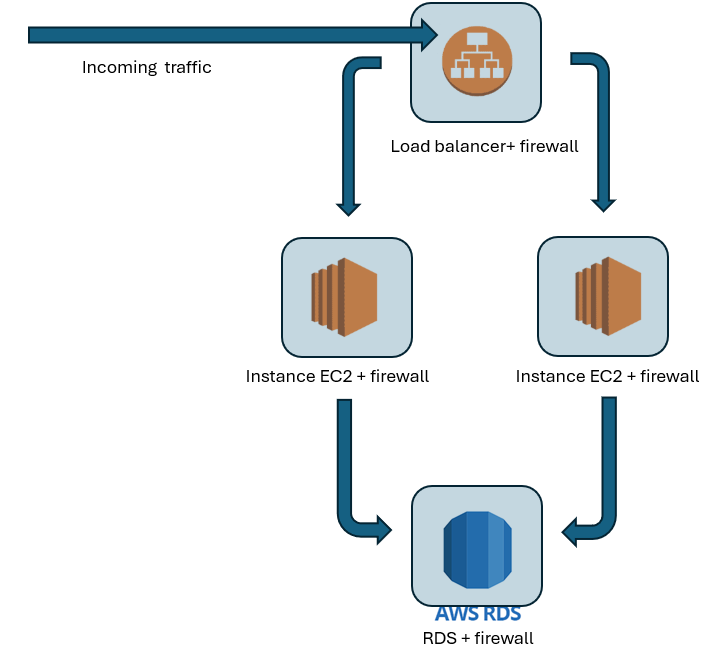
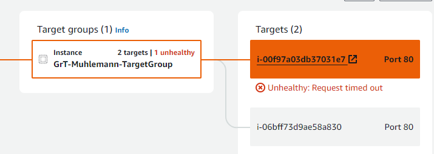
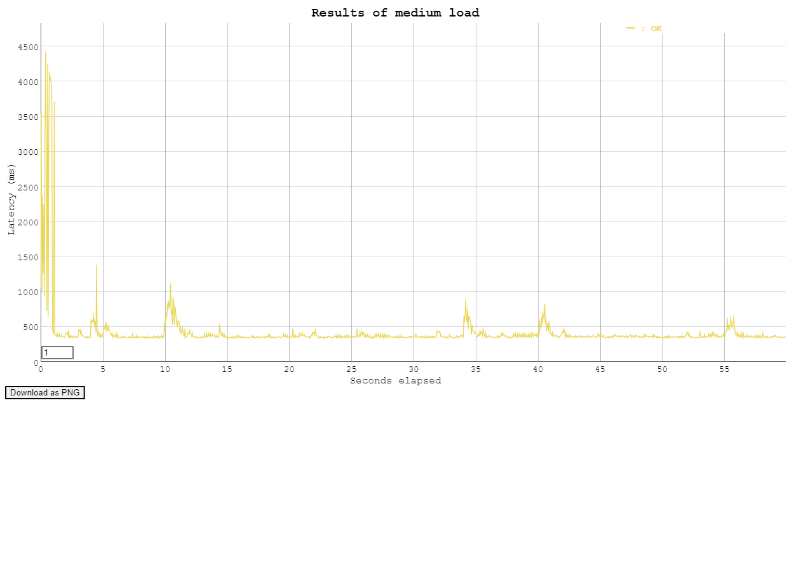
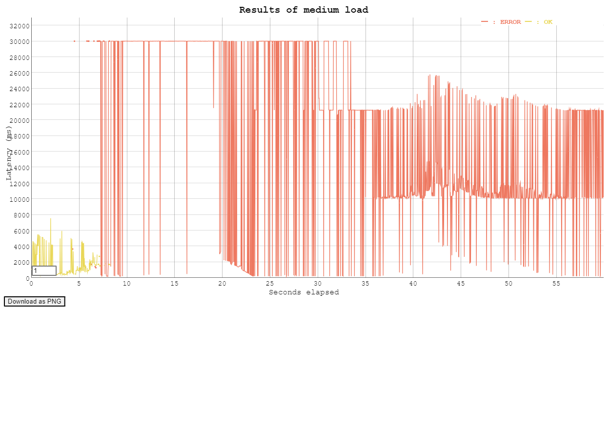

# CLD Lab 02 : APP SCALING ON IAAS

Authors : Butty Vicky & Mühlemann Julien

Group : L2GrT

Date : 8.4.2024


# TASK 1: CREATE A DATABASE USING THE RELATIONAL DATABASE SERVICE (RDS)
## credentials
* master: neiluj
* pwd: 536966a994e04ae3a56e1744bf36690d
* endpoint RDS address: grt-muhlemann-wordpress-db.crsk2uw660uhus-east-1.rds.amazonaws.com
* load balancer: GrT-Muhlemann-LoadBalancer-1001427955.us-east-1.elb.amazonaws.com
* worpress user: ubuntu
* wordpress pwd: chat


> DELIVERABLE 1: Copy the estimated monthly cost for the database and add it to your report.
```text
in the N. Virginia region a db.t3.micro instance costs $0.017 per hour
Storage type gp2 costs $0.115 per GB-month.
Cost for EC2 instance: 0.0116$ /heure
```
> Compare the costs of your RDS instance to a continuously running EC2 instance of the same instance type to see how much AWS charges for the extra functionality.
```text
cost EC2: 0.0116$ * 24 * 30 = 8.352$
cost EC2 storage 0.08$ * 20GB = 1.6$
= 9.952$

cost RDS: 0.017$ * 24 * 30 = 12.24$
cost RDS storage 20GB * 0.115$ = 2.3$
= 14.54$
```
> In a two-tier architecture the web application and the database are kept separate and run on different hosts. Imagine that for the second tier instead of using RDS to store the data you would create a virtual machine in EC2 and install and run yourself a database on it. If you were the Head of IT of a medium-size business, how would you argue in favor of using a database as a service instead of running your own database on an EC2 instance? How would you argue against it?

```text
Advantages of using a RDS:

* Maintenances tasks are overtaken by the provider (AWS) and allow us to focus solely on high value task.
* Security architecture may be better implemented by the provider (AWS) than if we decided to implement everything from scratch.
* Built-in recovery and redundancy in case of breakdown of the hardware.

Disadvantages of using RDS:

* Vendor lock-in: may end up dependant of a certain DbAAS (database as a service) provider.
* Restrictions in design if we decide to make fine tweaks that are not doable within options of provider.
* Cost may be unpredictable, if we need a swift scale up the costs could turn out to be overwhelming.
```
> Copy the endpoint address of the database into the report.
* endpoint RDS address: grt-muhlemann-wordpress-db.crsk2uw660uhus-east-1.rds.amazonaws.com

# TASK 2: CONFIGURE THE WORDPRESS MASTER INSTANCE TO USE THE RDS DATABASE

> DELIVERABLE 2:
```bash
// ** Database settings - You can get this info from your web host ** //
/** The name of the database for WordPress */
define( 'DB_NAME', 'rds_db_name' );

/** Database username */
define( 'DB_USER', 'neiluj' );

/** Database password */
define( 'DB_PASSWORD', '536966a994e04ae3a56e1744bf36690d' );

/** Database hostname */
define( 'DB_HOST', 'grt-muhlemann-wordpress-db.crsk2uw660uh.us-east-1.rds.amazonaws.com' );

/** Database charset to use in creating database tables. */
define( 'DB_CHARSET', 'utf8' );
```


# TASK 3: CREATE A CUSTOM VIRTUAL MACHINE IMAGE

> DELIVERABLE 3:


# TASK 4: CREATE A LOAD BALANCER

> DELIVERABLE 4:

> On your local machine resolve the DNS name of the load balancer into an IP address using the nslookup command (works on Linux, macOS and Windows). Write the DNS name and the resolved IP Address(es) into the report.

```bash
nslookup GrT-Muhlemann-LoadBalancer-1578369946.us-east-1.elb.amazonaws.com
Server:  internetbox.home
Address:  192.168.1.1

Non-authoritative answer:
Name:    GrT-Muhlemann-LoadBalancer-1578369946.us-east-1.elb.amazonaws.com
Addresses:  34.194.59.123
          34.231.114.29
```


> In the Apache access log identify the health check accesses from the load balancer and copy some samples into the report.

```bash
172.31.28.120 - - [21/Mar/2024:13:14:48 +0000] "GET / HTTP/1.1" 200 14905 "-" "ELB-HealthChecker/2.0"
172.31.28.120 - - [21/Mar/2024:13:14:58 +0000] "GET / HTTP/1.1" 200 14905 "-" "ELB-HealthChecker/2.0"
172.31.28.120 - - [21/Mar/2024:13:15:08 +0000] "GET / HTTP/1.1" 200 14905 "-" "ELB-HealthChecker/2.0"
```


# TASK 5: LAUNCH A SECOND INSTANCE FROM THE CUSTOM IMAGE

> DELIVERABLE 5:





> Calculate the monthly cost of this setup. You can ignore traffic costs.

```text

For Application Load Balancers in the AWS Region:

cost load balancer / month
= 16$
-----------------
cost EC2 
0.08$ / GB /month
  0.08$ *8GB =  0.64$ / month for storage

0.0116$ / hour
  0.0116$ * 24 * 30 = 8.352$ / month for EC2 instance

0.64$ + 8.352$
= 8,992$
------------------
cost RDS / month
= 14.54$
------------------
So we have:
  2 * 9.108$
  1 * 14.54$
+ 1 * 16$
= 48.756$ / month for this infrastructure
```

# TASK 5B: DELETE AND RE-CREATE THE LOAD BALANCER USING THE COMMAND LINE INTERFACE

> DELIVERABLE 5B:

```bash
delete load balancer 

$ aws elbv2 delete-load-balancer --load-balancer-arn arn:aws:elasticloadbalancing:us-east-1:851725581851:loadbalancer/app/GrT-Muhlemann-LoadBalancer/93451ddd1c0fb442


recreate load balancer 

$ aws elbv2 create-load-balancer --name GrT-Muhlemann-LoadBalancer --subnets subnet-07f74df2f9ca79cef subnet-0a2ab628966261f50 --security-groups sg-09af380c34ef9eca1 --scheme internet-facing --type application --ip-address-type ipv4


Recreate listener

$ aws elbv2 create-listener --load-balancer-arn arn:aws:elasticloadbalancing:us-east-1:851725581851:loadbalancer/app/GrT-Muhlemann-LoadBalancer/ff2820a6c04138eb --protocol HTTP --port 80 --default-action Type=forward,TargetGroupArn=arn:aws:elasticloadbalancing:us-east-1:851725581851:targetgroup/GrT-Muhlemann-TargetGroup/70f34336204362ac

```


# TASK 6: TEST THE DISTRIBUTED APPLICATION

> DELIVERABLE 6:

> Document your observations. Include reports and graphs of the load testing tool and the AWS console monitoring output.

```bash
$ echo "GET http://GrT-Muhlemann-LoadBalancer-1578369946.us-east-1.elb.amazonaws.com:80/wp-admin" | ./v attack -rate 5 -duration=60s | tee results.bin | ./v report

$ cat results.bin | ./v plot -title='Results of medium load' > results-plot.html
```
```text
We tested our system with a rate of 5 to 30. At 30 req/sec our system seemed already to be blowing off.
As the plots testify, below 20 req/sec the system was still handling the load. While at 30 as the control panel showed, the health checks were actually not possible any more. We can see one instance got unavailable.

After the burst we happened to wait for a couple of minutes to use the machines again.

```

We can see here that one of the instance is perceived as 'unhealthy' because of the massive load.


At rate of 20 req/sec the system was able to handle, even though we have fairly long response time at the beginning.


Here at 30 req / sec the system was already overwhelmed. So we got by and large error response [code 500]. 



> When you resolve the DNS name of the load balancer into IP addresses what do you see? Explain.

```text
We have not observed any IP change while testing the infrastructure.
```

```bash
nslookup GrT-Muhlemann-LoadBalancer-1578369946.us-east-1.elb.amazonaws.com
Server:  internetbox.home
Address:  192.168.1.1

Non-authoritative answer:
Name:    GrT-Muhlemann-LoadBalancer-1578369946.us-east-1.elb.amazonaws.com
Addresses:  34.194.59.123
          34.231.114.29
```

> Did this test really test the load balancing mechanism? What are the limitations of this simple test? What would be necessary to do realistic testing?

```text

The procedure did not test our system comprehensively here's some ideas:

* The load as been increased incrementally this does not reflect real-life scenario.
* The test is limited at 1 minute session. We do not know how it behaves in the long run. We could have ressources exhaustion or issues that turn up after a certain amount of time.
* The test is utterly dependant of out domestic network settings.

We could consider the following ideas to make the test more realistic:

* To mimic real world scenarios we need to apply stochastic variation of load and more importantly on a larger scope of time.
* We can monitor the ressources of the machines more accurately (CPU, RAM...) rather than just observe the AWS panel.
* We could send a couple of burst from different locations to assess how the load balancer is reacting.

```
