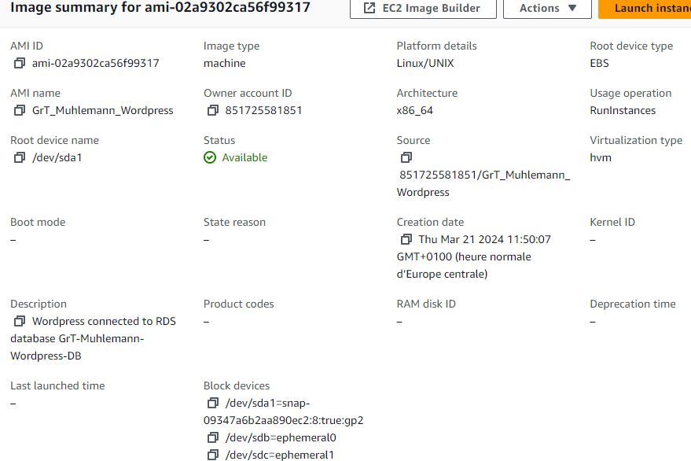

<div style="page-break-after: always; break-after: page;"></div>


## TASK 1: CREATE A DATABASE USING THE RELATIONAL DATABASE SERVICE (RDS)

> DELIVERABLE 1 :
>
> - Copy the estimated monthly cost for the database and add it to your report.
As the estimated monthly cost wasn't displayed when creating the database, we calculated it :
$$
\begin{align*} 
& \text{Price for the db.t3.micro instance : } $0.017 \text{ per hour}\\
& \text{Price for the gp2 storage : } $0.115 \text{ per GB-month}\\
\\
& \text{Total price over the month : } $0.017*24*30 + $0.115*20 = $14.54
\end{align*}
$$


> - Compare the costs of your RDS instance to a continuously running EC2 instance of the same instance type to see how much AWS charges for the extra functionality.

$$
\begin{align*} 
& \text{Price for the EC2 instance : } $0.0116 \text{ per hour}\\
& \text{Price for the EBS volume : } $0.08 \text{ per GB-month}\\
\\
& \text{Total price over the month : } $0.0116*24*30 + $0.08*20 \approx $9.95\\
\\
& \text{Difference of price over the month : } $14.54 - $9.95 = $4.59
\end{align*}
$$

Comparing the two prices, we see that AWS charges an additional $4.59 per month for the RDS instance, which is just over half a cent per hour.


> - In a two-tier architecture the web application and the database are kept separate and run on different hosts. Imagine that for the second tier instead of using RDS to store the data you would create a virtual machine in EC2 and install and run yourself a database on it. If you were the Head of IT of a medium-size business, how would you argue in favor of using a database as a service instead of running your own database on an EC2 instance? How would you argue against it?

Advantages of using a RDS:

* Maintenances tasks are overtaken by the provider (AWS) and allow us to focus solely on high value task.
* Security architecture may be better implemented by the provider (AWS) than if we decided to implement everything from scratch.
* Built-in recovery and redundancy in case of breakdown of the hardware.

Disadvantages of using RDS:

* Vendor lock-in: may end up dependant of a certain DbAAS (database as a service) provider.
* Limitations in design if we decide to do fine tuning that is not feasible within the vendor's options.
* Cost may be unpredictable, if we need a swift scale up the costs could turn out to be overwhelming.


> - Copy the endpoint address of the database into the report.
The RDS endpoints address is :

```
grt-muhlemann-wordpress-db.crsk2uw660uhus-east-1.rds.amazonaws.com
```


## TASK 2: CONFIGURE THE WORDPRESS MASTER INSTANCE TO USE THE RDS DATABASE

> DELIVERABLE 2:
>
> - Copy the part of **/var/www/html/wp-config.php** that configures the database into the report.
```bash
// ** Database settings - You can get this info from your web host ** //
/** The name of the database for WordPress */
define( 'DB_NAME', 'rds_db_name' );

/** Database username */
define( 'DB_USER', 'neiluj' );

/** Database password */
define( 'DB_PASSWORD', '536966a994e04ae3a56e1744bf36690d' );

/** Database hostname */
define( 'DB_HOST', 'grt-muhlemann-wordpress-db.crsk2uw660uh.us-east-1.rds.amazonaws.com' );

/** Database charset to use in creating database tables. */
define( 'DB_CHARSET', 'utf8' );
```


## TASK 3: CREATE A CUSTOM VIRTUAL MACHINE IMAGE

> DELIVERABLE 3:
>
> - Copy a screenshot of the AWS console showing the AMI parameters into the report.




## TASK 4: CREATE A LOAD BALANCER

> DELIVERABLE 4:
>
> - On your local machine resolve the DNS name of the load balancer into an IP address using the nslookup command (works on Linux, macOS and Windows). Write the DNS name and the resolved IP Address(es) into the report.

```bash
$ nslookup GrT-Muhlemann-LoadBalancer-1578369946.us-east-1.elb.amazonaws.com
Server:  internetbox.home
Address:  192.168.1.1

Non-authoritative answer:
Name:    GrT-Muhlemann-LoadBalancer-1578369946.us-east-1.elb.amazonaws.com
Addresses:  34.194.59.123
          34.231.114.29
```


> - In the Apache access log identify the health check accesses from the load balancer and copy some samples into the report.

```bash
172.31.28.120 - - [21/Mar/2024:13:14:48 +0000] "GET / HTTP/1.1" 200 14905 "-" "ELB-HealthChecker/2.0"
172.31.28.120 - - [21/Mar/2024:13:14:58 +0000] "GET / HTTP/1.1" 200 14905 "-" "ELB-HealthChecker/2.0"
172.31.28.120 - - [21/Mar/2024:13:15:08 +0000] "GET / HTTP/1.1" 200 14905 "-" "ELB-HealthChecker/2.0"
```


# TASK 5: LAUNCH A SECOND INSTANCE FROM THE CUSTOM IMAGE

> DELIVERABLE 5:
>
> - Draw a diagram of the setup you have created showing the components (instances, database, load balancer, client) and how they are connected. Include the security groups as well. Make sure to show every time a packet is filtered.


Note : Every time we have a firewall, the packets are filtered.


> - Calculate the monthly cost of this setup. You can ignore traffic costs.

$$
\begin{align*} 
& \text{Price for the load balancer : } $0.0225 \text{ per hour}\\
& \text{Total price for the load balancer : } $0.0225*24*30 = $16.2 \text{ per month}\\
\\
& \text{Price for the EC2 instance : } $0.0116 \text{ per hour}\\
& \text{Price for the EBS volume : } $0.08 \text{ per GB-month}\\
& \text{Total price for the EC2 instance : } $0.0116*24*30 + $0.08*8 = $8.992\text{ per month}\\
\\
& \text{Price for the db.t3.micro instance : } $0.017 \text{ per hour}\\
& \text{Price for the gp2 storage : } $0.115 \text{ per GB-month}\\
& \text{Total price for the RDS instance : } $0.017*24*30 + $0.115*20 = $14.54 \text{ per month}\\
\\
& \text{Total price of the setup over the month : } $8.992*2+$14.54+$16.2 \approx $48.72
\end{align*}
$$


## TASK 5B: DELETE AND RE-CREATE THE LOAD BALANCER USING THE COMMAND LINE INTERFACE

> DELIVERABLE 5B:
>
> - Put the commands to delete the load balancer, re-create the load balancer and re-create the listener into the report.

We deleted the load balancer with the command :

```bash
$ aws elbv2 delete-load-balancer --load-balancer-arn arn:aws:elasticloadbalancing:us-east-1:851725581851:loadbalancer/app/GrT-Muhlemann-LoadBalancer/93451ddd1c0fb442
```

And recreated it with :

```bash
$ aws elbv2 create-load-balancer --name GrT-Muhlemann-LoadBalancer --subnets subnet-07f74df2f9ca79cef subnet-0a2ab628966261f50 --security-groups sg-09af380c34ef9eca1 --scheme internet-facing --type application --ip-address-type ipv4
```

We re-created the listener with the command :

```bash
$ aws elbv2 create-listener --load-balancer-arn arn:aws:elasticloadbalancing:us-east-1:851725581851:loadbalancer/app/GrT-Muhlemann-LoadBalancer/ff2820a6c04138eb --protocol HTTP --port 80 --default-action Type=forward,TargetGroupArn=arn:aws:elasticloadbalancing:us-east-1:851725581851:targetgroup/GrT-Muhlemann-TargetGroup/70f34336204362ac
```


## TASK 6: TEST THE DISTRIBUTED APPLICATION

> DELIVERABLE 6:
>
> - Document your observations. Include reports and graphs of the load testing tool and the AWS console monitoring output.

We tested our system with a rate of 5 to 30 requests per second. At 30 req/sec our system seemed already to be blowing off.

As the plots testify, below 20 req/sec the system was still handling the load. While at 30 as the control panel showed, the health checks were actually not possible any more. We can see that one instance became unavailable.

After the outage, we happened to wait a few minutes before using the machines again.

The command used for this were the following :

```bash
$ echo "GET http://GrT-Muhlemann-LoadBalancer-1578369946.us-east-1.elb.amazonaws.com:80/wp-admin" | ./v attack -rate 5 -duration=60s | tee results.bin | ./v report

$ cat results.bin | ./v plot -title='Results of medium load' > results-plot.html
```


We can see here that one of the instance is perceived as 'unhealthy' because of the massive load.


At rate of 20 req/sec the system was able to handle, even though we have fairly long response time at the beginning.


Here at 30 req / sec the system was already overwhelmed. So we got by and large error response [code 500]. 


> - When you resolve the DNS name of the load balancer into IP addresses what do you see? Explain.

```bash
nslookup GrT-Muhlemann-LoadBalancer-1578369946.us-east-1.elb.amazonaws.com
Server:  internetbox.home
Address:  192.168.1.1

Non-authoritative answer:
Name:    GrT-Muhlemann-LoadBalancer-1578369946.us-east-1.elb.amazonaws.com
Addresses:  34.194.59.123
          34.231.114.29
```

We did not observe any IP changes while testing the infrastructure. This should be because the load balancer must have a static IP address to ensure consistent access for the clients.


> - Did this test really test the load balancing mechanism? What are the limitations of this simple test? What would be necessary to do realistic testing?

The procedure did not test our system exhaustively :

* The load as been increased incrementally this does not reflect real-life scenario.
* The test is limited to a 1 minute session. We do not know how it will behave in the long run. We might have resource exhaustion or problems that show up after a certain amount of time.
* The test is utterly dependant of out domestic network settings.


To improve the test in a more realistic way, we could consider the following ideas :

* To mimic real-world scenarios, we need to apply stochastic load variation and, more importantly, over a larger time span.
* We can monitor the resources of the machines (CPU, RAM...) more accurately rather than just observing the AWS panel.
* We could send a few bursts from different locations to see how the load balancer reacts.
