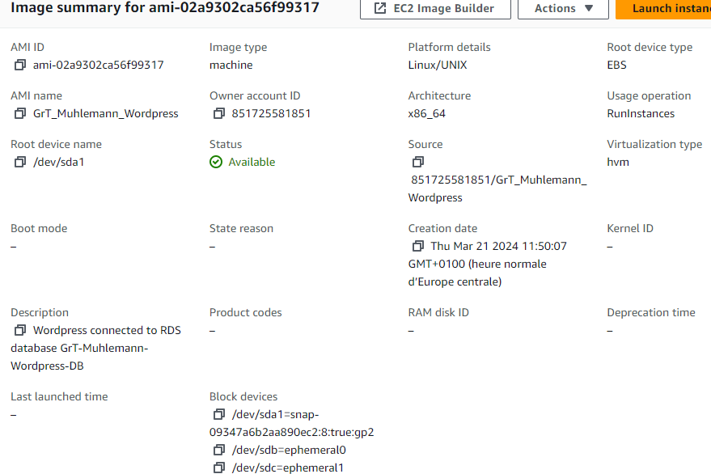

# TASK 1: CREATE A DATABASE USING THE RELATIONAL DATABASE SERVICE (RDS)
## credentials
```shell
master: neiluj
pwd: 536966a994e04ae3a56e1744bf36690d
endpoint RDS address: grt-muhlemann-wordpress-db.crsk2uw660uhus-east-1.rds.amazonaws.com
load balancer: GrT-Muhlemann-LoadBalancer-1001427955.us-east-1.elb.amazonaws.com
```

> DELIVERABLE 1: Copy the estimated monthly cost for the database and add it to your report.
```text
in the N. Virginia region a db.t3.micro instance costs $0.017 per hour. Storage type gp2 costs $0.115 per GB-month.
```

> Compare the costs of your RDS instance to a continuously running EC2 instance of the same instance type to see how much AWS charges for the extra functionality.

> In a two-tier architecture the web application and the database are kept separate and run on different hosts. Imagine that for the second tier instead of using RDS to store the data you would create a virtual machine in EC2 and install and run yourself a database on it. If you were the Head of IT of a medium-size business, how would you argue in favor of using a database as a service instead of running your own database on an EC2 instance? How would you argue against it?

> Copy the endpoint address of the database into the report.


> DELIVERABLE 2:
```bash
// ** Database settings - You can get this info from your web host ** //
/** The name of the database for WordPress */
define( 'DB_NAME', 'rds_db_name' );

/** Database username */
define( 'DB_USER', 'neiluj' );

/** Database password */
define( 'DB_PASSWORD', '536966a994e04ae3a56e1744bf36690d' );

/** Database hostname */
define( 'DB_HOST', 'grt-muhlemann-wordpress-db.crsk2uw660uh.us-east-1.rds.amazonaws.com' );

/** Database charset to use in creating database tables. */
define( 'DB_CHARSET', 'utf8' );
```


> DELIVERABLE 3:




> DELIVERABLE 4:
```bash
172.31.28.120 - - [21/Mar/2024:13:14:48 +0000] "GET / HTTP/1.1" 200 14905 "-" "ELB-HealthChecker/2.0"
172.31.28.120 - - [21/Mar/2024:13:14:58 +0000] "GET / HTTP/1.1" 200 14905 "-" "ELB-HealthChecker/2.0"
172.31.28.120 - - [21/Mar/2024:13:15:08 +0000] "GET / HTTP/1.1" 200 14905 "-" "ELB-HealthChecker/2.0"
```