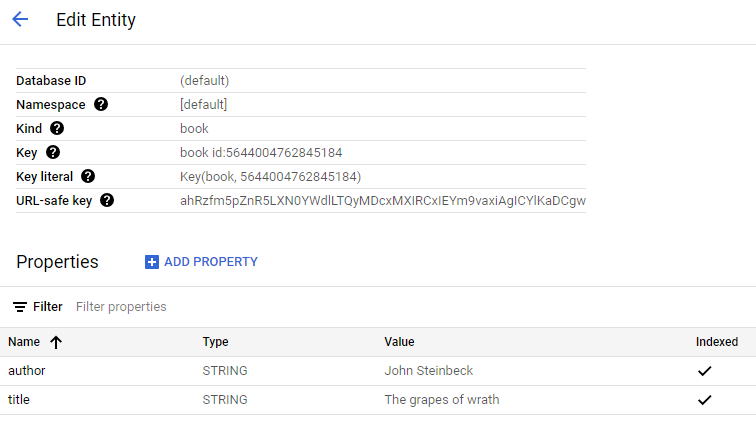
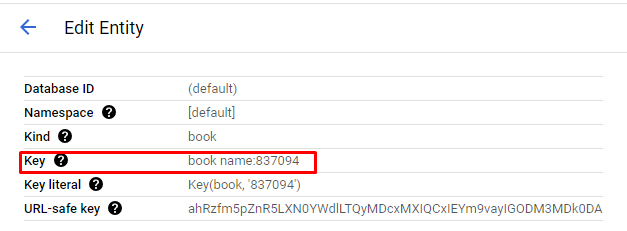
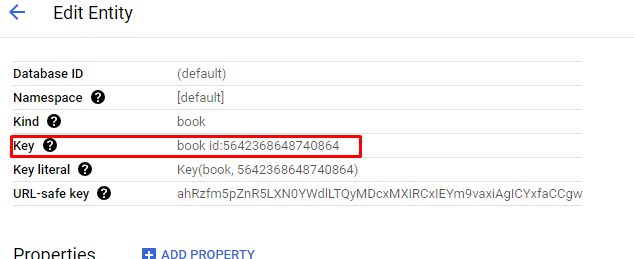

<div style="page-break-after: always; break-after: page;"></div>


## TASK 1: DEPLOYMENT OF A SIMPLE WEB APPLICATION

> DELIVERABLE
>
> Copy the Maven command to the report.

```bash
$ ./mvnw clean package --batch-mode -DskipTests -Dhttp.keepAlive=false -f=pom.xml --quiet
```


## TASK 2: ADD A CONTROLLER THAT WRITES TO THE DATASTORE


> DELIVERABLE
>
> Copy a screenshot of Datastore Studio with the written entity into the report.




## TASK 3: 

> DELIVERABLE
>
> Copy a code listing of your app into the report.


We have tested out application. We can see the application is recording the value as given in url. More specifically the key has been recoded as given.


In case of missing key, we can see that the app is generating automatically an ID for us.


And in case of missing _kind field the error is turning up.


Here is the code of the app:
```java

package com.example.appengine.springboot;

import org.springframework.boot.SpringApplication;
import org.springframework.boot.autoconfigure.SpringBootApplication;
import org.springframework.web.bind.annotation.GetMapping;
import org.springframework.web.bind.annotation.RestController;
import org.springframework.web.bind.annotation.RequestParam;

import com.google.cloud.datastore.Datastore;
import com.google.cloud.datastore.DatastoreOptions;
import com.google.cloud.datastore.Entity;
import com.google.cloud.datastore.Key;
import com.google.cloud.datastore.KeyFactory;

import java.util.Map;

@SpringBootApplication
@RestController
public class DemoApplication {

    private final Datastore datastore = DatastoreOptions.getDefaultInstance().getService();


    public static void main(String[] args) {
        SpringApplication.run(DemoApplication.class, args);
    }

    @GetMapping("/")
    public String hello() {
        return "Hello, world!";
    }


    @GetMapping("/dswritesimple")
    public String writeEntityToDatastoreSimple(@RequestParam Map<String, String> queryParameters) {
        StringBuilder message = new StringBuilder();

        KeyFactory keyFactory = datastore.newKeyFactory().setKind("book");
        Key key = datastore.allocateId(keyFactory.newKey());
        Entity entity = Entity.newBuilder(key)
                .set("title", "The grapes of wrath")
                .set("author", "John Steinbeck")
                .build();
        message.append("Writing entity to Datastore\n");
        datastore.put(entity);
        Entity retrievedEntity = datastore.get(key);
        message.append("Entity retrieved from Datastore: "
                + retrievedEntity.getString("title")
                + " " + retrievedEntity.getString("author")
                + "\n");
        return message.toString();
    }

    @GetMapping("/dswrite")
    public String WriteEntryToDataStore(@RequestParam Map<String, String> queryParameters) {
        if (!queryParameters.containsKey("_kind")) {
            return "Error: The '_kind' field is required.";
        }

        String kind = queryParameters.get("_kind");
        KeyFactory keyFactory = datastore.newKeyFactory().setKind(kind);

        Key key;
        if (queryParameters.containsKey("_key")) {
            key = keyFactory.newKey(queryParameters.get("_key"));
        } else {
            key = datastore.allocateId(keyFactory.newKey());
        }

        Entity.Builder entityBuilder = Entity.newBuilder(key);

        for (Map.Entry<String, String> entry : queryParameters.entrySet()) {
            String fieldName = entry.getKey();
            if (!fieldName.startsWith("_")) { // Exclude special fields like _kind, _key
                entityBuilder.set(fieldName, entry.getValue());
            }
        }

        Entity entity = entityBuilder.build();
        datastore.put(entity);

        return "Entity written with kind '" + kind + "' and key '" + key.getName() + "'.";
    }


}

```


## TASK 4: TEST THE PERFORMANCE OF DATASTORE WRITES

> Deliverables:

>1. For each performance test include a graph of the load testing tool and copy three screenshots of the >App Engine instances view (graph of requests by type, graph of number of instances, graph of latency) >into the report.


>2. What average response times do you observe in the test tool for each controller?


TODO :get rid of those commands just to recall during the lab

$ echo "GET https://nifty-stage-420711.uc.r.appspot.com/dswrite?_kind=book" | ./v attack -duration=50s -rate=70 | tee results_r_70_t_50_data_store.bin | ./v report

$ cat results_r_60_t_50.bin | ./v plot -title='Results of medium load' > results-plot_hello_w.html

>3. Compare the response times shown by the test tool and the App Engine console. Explain the difference.


>4. How much resources have you used running these tests? From the Quota Details view of the console >determine the non-zero resource quotas (Daily quota different from 0%). Explain each with a sentence. >To get a sense of everything that is measured click on Show resources not in use.


>5. Let’s suppose you become suspicious that the algorithm for the automatic scaling of instances is not >working correctly. Imagine a way in which the algorithm could be broken. Which measures shown in the >console would you use to detect this failure?


