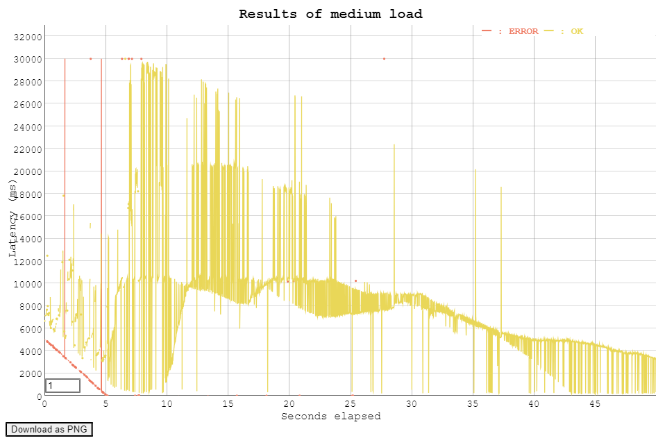

<div style="page-break-after: always; break-after: page;"></div>


## TASK 1: DEPLOYMENT OF A SIMPLE WEB APPLICATION

> DELIVERABLE
>
> Copy the Maven command to the report.

```bash
$ ./mvnw clean package --batch-mode -DskipTests -Dhttp.keepAlive=false -f=pom.xml --quiet
```


> 6. Navigate to the Cloud Storage console. You should see two buckets, one called `staging.*`. Browse the files in the bucket. There is a file with type `application/java-archive`. This is the jar file that is the result of the build.

When we looked for the `application/java-archive` type of file, we couldn't find it. The closest type of files were `application/octet-stream` type files, as shown below :


<div style="page-break-after: always; break-after: page;"></div>

## TASK 2: ADD A CONTROLLER THAT WRITES TO THE DATASTORE

> DELIVERABLE
>
> Copy a screenshot of Datastore Studio with the written entity into the report.


## TASK 3: DEVELOP A CONTROLLER TO WRITE ARBITRARY ENTITIES INTO THE DATASTORE

> DELIVERABLE
>
> Copy a code listing of your app into the report.

We have tested the application. We can see that the application is recording the value as given in url. More specifically, the key has been recoded as given.


If the key is missing, we can see that the application automatically generates an ID for us.


And in case of missing `_kind` field, the error will show up.


Here is the code of the app:

```java
package com.example.appengine.springboot;

import org.springframework.boot.SpringApplication;
import org.springframework.boot.autoconfigure.SpringBootApplication;
import org.springframework.web.bind.annotation.GetMapping;
import org.springframework.web.bind.annotation.RestController;
import org.springframework.web.bind.annotation.RequestParam;

import com.google.cloud.datastore.Datastore;
import com.google.cloud.datastore.DatastoreOptions;
import com.google.cloud.datastore.Entity;
import com.google.cloud.datastore.Key;
import com.google.cloud.datastore.KeyFactory;

import java.util.Map;

@SpringBootApplication
@RestController
public class DemoApplication {

    private final Datastore datastore = DatastoreOptions.getDefaultInstance().getService();


    public static void main(String[] args) {
        SpringApplication.run(DemoApplication.class, args);
    }

    @GetMapping("/")
    public String hello() {
        return "Hello, world!";
    }


    @GetMapping("/dswritesimple")
    public String writeEntityToDatastoreSimple(@RequestParam Map<String, String> queryParameters) {
        StringBuilder message = new StringBuilder();

        KeyFactory keyFactory = datastore.newKeyFactory().setKind("book");
        Key key = datastore.allocateId(keyFactory.newKey());
        Entity entity = Entity.newBuilder(key)
                .set("title", "The grapes of wrath")
                .set("author", "John Steinbeck")
                .build();
        message.append("Writing entity to Datastore\n");
        datastore.put(entity);
        Entity retrievedEntity = datastore.get(key);
        message.append("Entity retrieved from Datastore: "
                + retrievedEntity.getString("title")
                + " " + retrievedEntity.getString("author")
                + "\n");
        return message.toString();
    }

    @GetMapping("/dswrite")
    public String WriteEntryToDataStore(@RequestParam Map<String, String> queryParameters) {
        if (!queryParameters.containsKey("_kind")) {
            return "Error: The '_kind' field is required.";
        }

        String kind = queryParameters.get("_kind");
        KeyFactory keyFactory = datastore.newKeyFactory().setKind(kind);

        Key key;
        if (queryParameters.containsKey("_key")) {
            key = keyFactory.newKey(queryParameters.get("_key"));
        } else {
            key = datastore.allocateId(keyFactory.newKey());
        }

        Entity.Builder entityBuilder = Entity.newBuilder(key);

        for (Map.Entry<String, String> entry : queryParameters.entrySet()) {
            String fieldName = entry.getKey();
            if (!fieldName.startsWith("_")) { // Exclude special fields like _kind, _key
                entityBuilder.set(fieldName, entry.getValue());
            }
        }

        Entity entity = entityBuilder.build();
        datastore.put(entity);

        return "Entity written with kind '" + kind + "' and key '" + key.getName() + "'.";
    }
}
```


## TASK 4: TEST THE PERFORMANCE OF DATASTORE WRITES

> Deliverables:

>1. For each performance test include a graph of the load testing tool and copy three screenshots of the App Engine instances view (graph of requests by type, graph of number of instances, graph of latency) into the report.


* At 14:10, we launch a first burst of requests on the simple controller (hello world). 
  duration=50'' and rate=70 

* Then, at 14:20, we kicked off our second test on the second controller interacting with the datastore. duration=50'' and rate=70


**Number of instances**

We notice an increase of the number of active instances at 14:10 for the first attack on the simple controller.

We observe the number of instances increasing at 14:25 at the start of our second test.


**Latency of requests**

We don't see any significant latency degradation for the simple controller test at 14:10.

At 14:25 we see that the response time increases dramatically. This is probably due to the controller writing data to the datastore.


**Requests by type**

We can observe that even though we performed the same duration and same frequency of requests I.E. 50'' and 70 r/sec, the app can handle more requests on the first burst (peak at 14:12).

When the app needs to write data into the datastore it needs significantly more time to do so. Therefore we peaked at 50 req/sec for the second test.


**Plot of the load with the hello world controller**

Here we probably experience the 'cold start'. Since we had 0 instances active (see first plot at 14:10), Google had to instantiate some machines to execute our requests. Therefore we observe that descending slope form 0 to 5 seconds.


<div style="page-break-after: always; break-after: page;"></div>

**Plot of the load with the dswrite controller**

Here we observe probably once more the cold start from 0 to 5. Conversely we notice that ou app needs significantly more time to handle the load. It needs to interact with the datastore every time.



>2. What average response times do you observe in the test tool for each controller?

We can see we got an average response time of 424 ms for the simple controller. Whereas we get 8 seconds for the dswrite controller.


>3. Compare the response times shown by the test tool and the App Engine console. Explain the difference.

We got 20 seconds for the second burst with the dswrite controller.
And 20.46 seconds for the test tools for 95% of the requests.

Network latency can affect the results between the two performance analysis tools. Vegeta measures response time from the client perspective. This includes network latency from the local network. While Google metrics may measure latency closer to the server PaaS.


>5. Let’s suppose you become suspicious that the algorithm for the automatic scaling of instances is not working correctly. Imagine a way in which the algorithm could be broken. Which measures shown in the console would you use to detect this failure?

The measures we could use to suspect a failure in the algorithm could be :


- Number of instances: Spikes or drops in these metrics can indicate potential scaling issues.

- Resource usage: Overall resource usage across the project, including CPU, memory, and network usage. Anomalies in resource utilization can indicate scaling issues or inefficiencies.

- Cost analysis: Analyze the cost breakdown for the project to identify unexpected increases in the cost of instances or other resources. Over-provisioning or inefficient scaling can lead to higher than expected costs.

- Instance count: Monitoring the number of instances running at any given time can help determine if the algorithm is algorithm is creating too many or too few instances.
  
- Response time: Monitoring response times for specific tasks or operations can help determine if the algorithm is creating instances that are slow to respond or taking too long to complete tasks.
