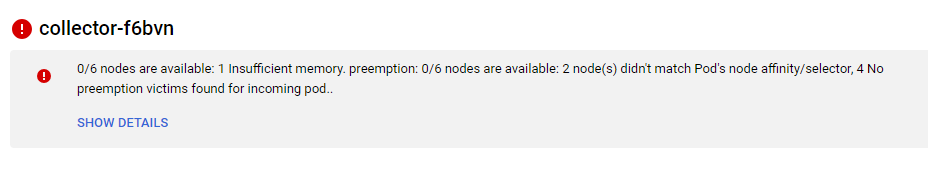
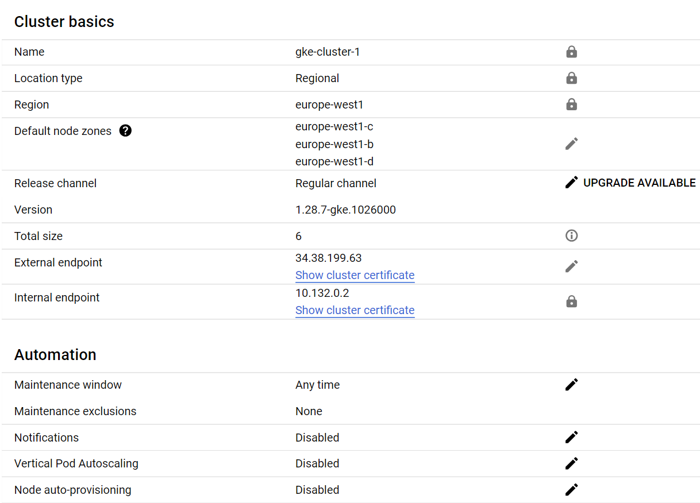
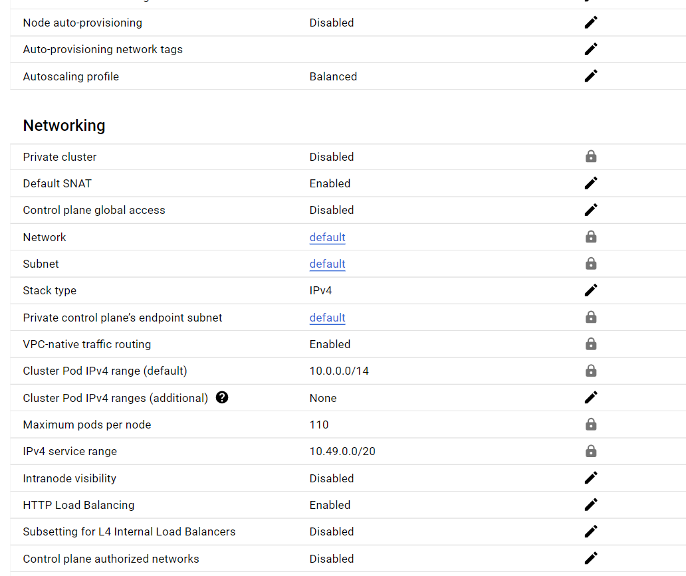
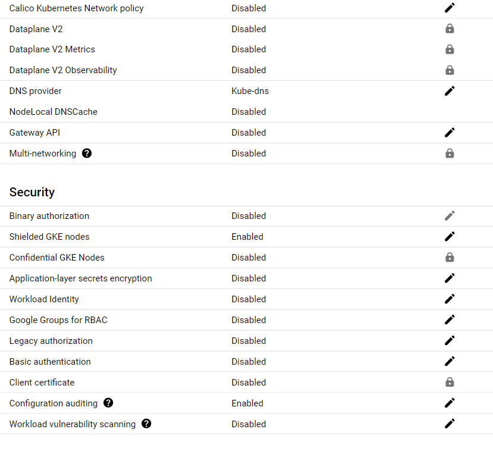
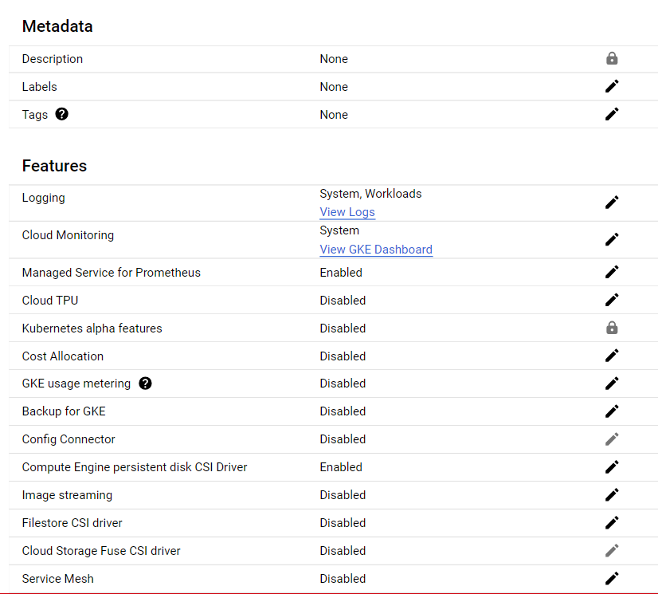

<div style="page-break-after: always; break-after: page;"></div>


## TASK 1: DEPLOY THE APPLICATION ON A LOCAL TEST CLUSTER


>Document any difficulties you faced and how you overcame them.

```text
We first tried to access to the port 8081 on the browser whereas the port forwarding was set to forward from 8001:8080. Not a big deal.

$ kubectl port-forward frontend 8081:8080
```
> Copy the object descriptions into the lab report.

```bash
$ kubectl describe pods
```
- api
```text
Name:             api
Namespace:        default
Priority:         0
Service Account:  default
Node:             minikube/172.18.218.60
Start Time:       Thu, 16 May 2024 10:11:12 +0200
Labels:           app=todo
                  component=api
Annotations:      <none>
Status:           Running
IP:               10.244.0.7
IPs:
  IP:  10.244.0.7
Containers:
  api:
    Container ID:   docker://47b5dd986716907f212ea517f75bd1659a94ffe09c980ea3d4e7088aff7ae489
    Image:          icclabcna/ccp2-k8s-todo-api
    Image ID:       docker-pullable://icclabcna/ccp2-k8s-todo-api@sha256:13cb50bc9e93fdf10b4608f04f2966e274470f00c0c9f60815ec8fc987cd6e03
    Port:           8081/TCP
    Host Port:      0/TCP
    State:          Running
      Started:      Thu, 16 May 2024 10:11:20 +0200
    Ready:          True
    Restart Count:  0
    Environment:
      REDIS_ENDPOINT:  redis-svc
      REDIS_PWD:       ccp2
    Mounts:
      /var/run/secrets/kubernetes.io/serviceaccount from kube-api-access-4rxs9 (ro)
Conditions:
  Type                        Status
  PodReadyToStartContainers   True
  Initialized                 True
  Ready                       True
  ContainersReady             True
  PodScheduled                True
Volumes:
  kube-api-access-4rxs9:
    Type:                    Projected (a volume that contains injected data from multiple sources)
    TokenExpirationSeconds:  3607
    ConfigMapName:           kube-root-ca.crt
    ConfigMapOptional:       <nil>
    DownwardAPI:             true
QoS Class:                   BestEffort
Node-Selectors:              <none>
Tolerations:                 node.kubernetes.io/not-ready:NoExecute op=Exists for 300s
                             node.kubernetes.io/unreachable:NoExecute op=Exists for 300s
Events:
  Type    Reason     Age   From               Message
  ----    ------     ----  ----               -------
  Normal  Scheduled  30m   default-scheduler  Successfully assigned default/api to minikube
  Normal  Pulling    30m   kubelet            Pulling image "icclabcna/ccp2-k8s-todo-api"
  Normal  Pulled     29m   kubelet            Successfully pulled image "icclabcna/ccp2-k8s-todo-api" in 7.953s (7.953s including waiting). Image size: 683793243 bytes.
  Normal  Created    29m   kubelet            Created container api
  Normal  Started    29m   kubelet            Started container api

```
- frontend
```text
Name:             frontend
Namespace:        default
Priority:         0
Service Account:  default
Node:             minikube/172.18.218.60
Start Time:       Thu, 16 May 2024 09:58:48 +0200
Labels:           app=todo
                  component=frontend
Annotations:      <none>
Status:           Running
IP:               10.244.0.6
IPs:
  IP:  10.244.0.6
Containers:
  frontend:
    Container ID:   docker://89628dd4a6b0c83b650399b3f8d2f73edd27eda86a57b1ae8856f51e20756a78
    Image:          icclabcna/ccp2-k8s-todo-frontend
    Image ID:       docker-pullable://icclabcna/ccp2-k8s-todo-frontend@sha256:5892b8f75a4dd3aa9d9cf527f8796a7638dba574ea8e6beef49360a3c67bbb44
    Port:           8080/TCP
    Host Port:      0/TCP
    State:          Running
      Started:      Thu, 16 May 2024 09:59:30 +0200
    Ready:          True
    Restart Count:  0
    Environment:
      API_ENDPOINT_URL:  http://api-svc:8081
    Mounts:
      /var/run/secrets/kubernetes.io/serviceaccount from kube-api-access-gzn8n (ro)
Conditions:
  Type                        Status
  PodReadyToStartContainers   True
  Initialized                 True
  Ready                       True
  ContainersReady             True
  PodScheduled                True
Volumes:
  kube-api-access-gzn8n:
    Type:                    Projected (a volume that contains injected data from multiple sources)
    TokenExpirationSeconds:  3607
    ConfigMapName:           kube-root-ca.crt
    ConfigMapOptional:       <nil>
    DownwardAPI:             true
QoS Class:                   BestEffort
Node-Selectors:              <none>
Tolerations:                 node.kubernetes.io/not-ready:NoExecute op=Exists for 300s
                             node.kubernetes.io/unreachable:NoExecute op=Exists for 300s
Events:
  Type    Reason     Age   From               Message
  ----    ------     ----  ----               -------
  Normal  Scheduled  42m   default-scheduler  Successfully assigned default/frontend to minikube
  Normal  Pulling    42m   kubelet            Pulling image "icclabcna/ccp2-k8s-todo-frontend"
  Normal  Pulled     41m   kubelet            Successfully pulled image "icclabcna/ccp2-k8s-todo-frontend" in 39.238s (39.238s including waiting). Image size: 746900794 bytes.
  Normal  Created    41m   kubelet            Created container frontend
  Normal  Started    41m   kubelet            Started container frontend
```
- redis
```text
Name:             redis
Namespace:        default
Priority:         0
Service Account:  default
Node:             minikube/172.18.218.60
Start Time:       Thu, 16 May 2024 09:19:23 +0200
Labels:           app=todo
                  component=redis
Annotations:      <none>
Status:           Running
IP:               10.244.0.5
IPs:
  IP:  10.244.0.5
Containers:
  redis:
    Container ID:  docker://ad1749b016061ed049ef6579dd1f4ac5bb85cd90cd47033e74c3001fcb616527
    Image:         redis
    Image ID:      docker-pullable://redis@sha256:5a93f6b2e391b78e8bd3f9e7e1e1e06aeb5295043b4703fb88392835cec924a0
    Port:          6379/TCP
    Host Port:     0/TCP
    Args:
      redis-server
      --requirepass ccp2
      --appendonly yes
    State:          Running
      Started:      Thu, 16 May 2024 09:19:30 +0200
    Ready:          True
    Restart Count:  0
    Environment:    <none>
    Mounts:
      /var/run/secrets/kubernetes.io/serviceaccount from kube-api-access-tnrfr (ro)
Conditions:
  Type                        Status
  PodReadyToStartContainers   True
  Initialized                 True
  Ready                       True
  ContainersReady             True
  PodScheduled                True
Volumes:
  kube-api-access-tnrfr:
    Type:                    Projected (a volume that contains injected data from multiple sources)
    TokenExpirationSeconds:  3607
    ConfigMapName:           kube-root-ca.crt
    ConfigMapOptional:       <nil>
    DownwardAPI:             true
QoS Class:                   BestEffort
Node-Selectors:              <none>
Tolerations:                 node.kubernetes.io/not-ready:NoExecute op=Exists for 300s
                             node.kubernetes.io/unreachable:NoExecute op=Exists for 300s
Events:                      <none>
```
```bash
$ kubectl describe svc
```
```text
 kubectl describe svc
Name:              api-svc
Namespace:         default
Labels:            component=api
Annotations:       <none>
Selector:          app=todo,component=api
Type:              ClusterIP
IP Family Policy:  SingleStack
IP Families:       IPv4
IP:                10.109.171.166
IPs:               10.109.171.166
Port:              api  8081/TCP
TargetPort:        8081/TCP
Endpoints:         10.244.0.7:8081
Session Affinity:  None
Events:            <none>


Name:              kubernetes
Namespace:         default
Labels:            component=apiserver
                   provider=kubernetes
Annotations:       <none>
Selector:          <none>
Type:              ClusterIP
IP Family Policy:  SingleStack
IP Families:       IPv4
IP:                10.96.0.1
IPs:               10.96.0.1
Port:              https  443/TCP
TargetPort:        8443/TCP
Endpoints:         172.18.218.60:8443
Session Affinity:  None
Events:            <none>


Name:              redis-svc
Namespace:         default
Labels:            component=redis
Annotations:       <none>
Selector:          app=todo,component=redis
Type:              ClusterIP
IP Family Policy:  SingleStack
IP Families:       IPv4
IP:                10.101.40.88
IPs:               10.101.40.88
Port:              redis  6379/TCP
TargetPort:        6379/TCP
Endpoints:         10.244.0.5:6379
Session Affinity:  None
Events:            <none>
```


## TASK 2: DEPLOY THE APPLICATION IN KUBERNETES ENGINE


> DELIVERABLE
> Document any difficulties you faced and how you overcame them. Copy the object descriptions into the lab report (if they are unchanged from the previous task just say so).

The pods at this steps have not changed since we only added a front end service for the load balancer (frontend-svc)

```text
We had the following error after deploying the pods and services into the google cluster. That does not seem to impair usage of the application.
```


> Take a screenshot of the cluster details from the GKE console. Copy the output of the kubectl describe command to describe your load balancer once completely initialized.

```text
Here is the screenshot of the cluster details.
```






```bash
$ kubectl describe svc/frontend-svc
```
```text
Name:                     frontend-svc
Namespace:                default
Labels:                   component=frontend
Annotations:              cloud.google.com/neg: {"ingress":true}
Selector:                 app=todo,component=frontend
Type:                     LoadBalancer
IP Family Policy:         SingleStack
IP Families:              IPv4
IP:                       10.49.11.106
IPs:                      10.49.11.106
LoadBalancer Ingress:     34.78.156.37
Port:                     frontend  80/TCP
TargetPort:               8080/TCP
NodePort:                 frontend  31352/TCP
Endpoints:                10.0.3.9:8080
Session Affinity:         None
External Traffic Policy:  Cluster
Events:                   <none>
```


## TASK 3: ADD AND EXERCISE RESILIENCE

> DELIVERABLE
> Document your observations in the lab report. Document any difficulties you faced and how you overcame them. Copy the object descriptions into the lab report.
```text
after deleting an api pod it took 27s to turn up another one.
```
```bash
kubectl get pods --watch
NAME                        READY   STATUS    RESTARTS        AGE
api-664fbdf7d9-mdcht        1/1     Running   2 (3m43s ago)   3m49s
api-664fbdf7d9-xgnpv        1/1     Running   0               3m49s
frontend-67879ff5df-kvbmw   1/1     Running   0               27s
frontend-67879ff5df-lxqsf   1/1     Running   0               3m56s
redis-56fb88dd96-5lt4z      1/1     Running   0               3m41s
api-664fbdf7d9-xgnpv        1/1     Terminating   0               4m26s
api-664fbdf7d9-jm6bh        0/1     Pending       0               0s
api-664fbdf7d9-jm6bh        0/1     Pending       0               0s
api-664fbdf7d9-jm6bh        0/1     ContainerCreating   0               0s
api-664fbdf7d9-jm6bh        1/1     Running             0               27s
api-664fbdf7d9-xgnpv        0/1     Terminating         0               4m57s
api-664fbdf7d9-xgnpv        0/1     Terminating         0               4m57s
api-664fbdf7d9-xgnpv        0/1     Terminating         0               4m57s
api-664fbdf7d9-xgnpv        0/1     Terminating         0               4m57s
```

```text
after deleting a front end pod it took 13s to restart another one
```
```bash
kubectl get pods --watch
NAME                        READY   STATUS    RESTARTS        AGE
api-664fbdf7d9-jm6bh        1/1     Running   0               2m59s
api-664fbdf7d9-mdcht        1/1     Running   2 (7m19s ago)   7m25s
frontend-67879ff5df-kvbmw   1/1     Running   0               4m3s
frontend-67879ff5df-lxqsf   1/1     Running   0               7m32s
redis-56fb88dd96-5lt4z      1/1     Running   0               7m17s
frontend-67879ff5df-lxqsf   1/1     Terminating   0               8m21s
frontend-67879ff5df-s9wxm   0/1     Pending       0               0s
frontend-67879ff5df-s9wxm   0/1     Pending       0               0s
frontend-67879ff5df-s9wxm   0/1     ContainerCreating   0               0s
frontend-67879ff5df-lxqsf   0/1     Terminating         0               8m22s
frontend-67879ff5df-lxqsf   0/1     Terminating         0               8m22s
frontend-67879ff5df-lxqsf   0/1     Terminating         0               8m22s
frontend-67879ff5df-lxqsf   0/1     Terminating         0               8m22s
frontend-67879ff5df-s9wxm   1/1     Running             0               13s
```


```bash
We can rapidly scale out with the command:
$ kubectl scale --replicas=3 deployment/frontend
```
```text
Before the scale out we had 2 desired front end service
```
```bash
NAME                                  DESIRED   CURRENT   READY   AGE
replicaset.apps/api-664fbdf7d9        2         2         2       27s
replicaset.apps/frontend-67879ff5df   2         2         2       32s
replicaset.apps/redis-56fb88dd96      1         1         1       22s
```

```text
After the scaling we get 3 desired front end pods
```
```bash
NAME                                  DESIRED   CURRENT   READY   AGE
replicaset.apps/api-664fbdf7d9        2         2         2       59s
replicaset.apps/frontend-67879ff5df   3         3         2       64s
replicaset.apps/redis-56fb88dd96      1         1         1       54s
```

```text
Obviously if we kill the redis pods we lose the database of the todos tasks entered.
```


```text
The autoscaling features available are:
- HPA that is horizontal pod autoscaler automatically adjusts the number of replicas based on CPU or different metric set by the user. I.E. average CPU utilization across all pods in the deployment, requests latency, 

- HVA that is vertical pod autoscaler automatically adjusts the resources requests of pods based on their resource usage patterns.


## TASK 4: Cleanup


