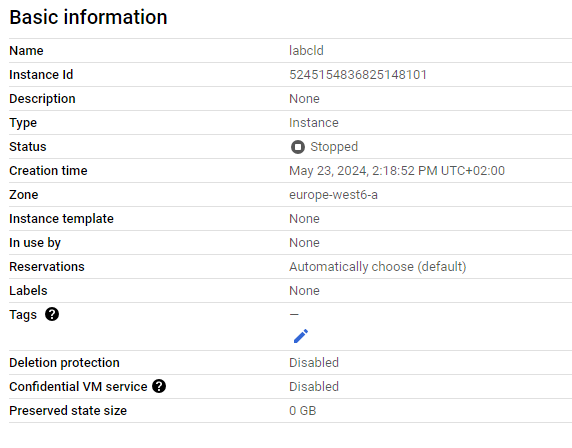

<div style="page-break-after: always; break-after: page;"></div>


## TASK 2: CREATE A CLOUD INFRASTRUCTURE ON GOOGLE COMPUTE ENGINE WITH TERRAFORM

> What files were created in the terraform directory? Make sure to look also at hidden files and directories (ls -a). What are they used for?


```bash
$ terraform apply -input=false .terraform/plan.cache
google_compute_instance.default: Creating...
google_compute_instance.default: Still creating... [10s elapsed]
google_compute_instance.default: Creation complete after 15s [id=projects/boxwood-spot-424211-j6/zones/europe-west6-a/instances/labcld]

Apply complete! Resources: 1 added, 0 changed, 0 destroyed.

Outputs:

gce_instance_ip = "34.65.74.220"
```


> Deliverables:

> Explain the usage of each provided file and its contents by directly adding comments in the file as needed (we must ensure that you understood what you have done). In the file variables.tf fill the missing documentation parts and link to the online documentation. Copy the modified files to the report.

backend.tf
```bash
terraform {
  backend "local" {
  }
}

# local backend saves state files on local filesystem

```


main.tf
```bash
# Defines the provider for Google Cloud Platform

provider "google" {
  project     = var.gcp_project_id # The GCP project ID
  region      = "europe-west6-a" # The desired region for resources
  credentials = file("${var.gcp_service_account_key_file_path}")# Path to GCP service account key file
}

# Resource: Google Compute Engine instance
resource "google_compute_instance" "default" {
  name         = var.gce_instance_name # Name of the GCE instance
  machine_type = "f1-micro" # Machine type for instance
  zone         = "europe-west6-a"  # Zone for instance
    
    # Set the SSH key for the instance

  metadata = {
    ssh-keys = "${var.gce_instance_user}:${file("${var.gce_ssh_pub_key_file_path}")}"
  }
  # Boot disk image for the instance

  boot_disk {
    initialize_params {
      image = "debian-cloud/debian-11"
    }
  }

  network_interface {
    network = "default"

    access_config {
      # Include this section to give the VM an external IP address
    }
  }
}
# Resource: Google Compute firewall for SSH

resource "google_compute_firewall" "ssh" {
  name          = "allow-ssh" # Name of firewall rule
  network       = "default" # Network for firewall rule
  source_ranges = ["0.0.0.0/0"]  # source IP ranges allowed to access
  allow {
    ports    = ["22"] # Allowed SSH port
    protocol = "tcp"   # Protocol for the firewall rule
  }
}
# Resource: Google Compute firewall for HTTP

resource "google_compute_firewall" "http" {
  name          = "allow-http" # Name of firewall rule
  network       = "default" # Network for  firewall rule
  source_ranges = ["0.0.0.0/0"] # Source IP ranges allowed to access
  allow {
    ports    = ["80"] # allowed HTTP port
    protocol = "tcp" #protocol for firewall rule
  }
}

```


outputs.ft
```bash
# Output google cloud instance IP address
output "gce_instance_ip" {
  value = google_compute_instance.default.network_interface.0.access_config.0.nat_ip
}

```

variables.tf
```bash

# variable declaration See https://developer.hashicorp.com/terraform/language/values/variables
variable "gcp_project_id" {
  description = ""
  type        = string
  nullable    = false
}

variable "gcp_service_account_key_file_path" {
  description = ""
  type        = string
  nullable    = false
}

variable "gce_instance_name" {
  description = ""
  type        = string
  nullable    = false
}

variable "gce_instance_user" {
  description = ""
  type        = string
  nullable    = false
}

variable "gce_ssh_pub_key_file_path" {
  description = ""
  type        = string
  nullable    = false
}

```

terraform.tfvars
```bash
# variable values setting
gcp_project_id = "boxwood-spot-424211-j6"
gcp_service_account_key_file_path = "credentials/labgce-service-account-key.json"
gce_instance_name = "labcld"
gce_instance_user = "jul"
gce_ssh_pub_key_file_path = "credentials/labgce-ssh-key.pub"

```


> Explain what the files created by Terraform are used for.
* terraform/plugin/ folder containing information about the providers and the version used.

* .terraform.lock.hcl a dependency lock file used to make sure the same provider versions are used each time the config is applied. This aid in maintaining consistent and reproductible deployments.

* .Identifier files used to uniquely identify the provider plugins. Each plugin will have a unique checksum to ensure integrity and authenticity of the plugin.

* terraform.tfstate keeps track of the current configuration

> Where is the Terraform state saved? Imagine you are working in a team and the other team members want to use Terraform, too, to manage the cloud infrastructure. Do you see any problems with this? Explain.

Normally Terraform saves the state file in the terraform.tfstate file in the local directory.

The challenge if used TF in a team is if multiple members run TF commands at the same time if can lead to inconsistencies in the state file. Each member shall ensure they work on the latest version before running any commands.
Moreover the state file can store potentially sensitive information e.g. IP addresses, ID, etc...


> What happens if you reapply the configuration (1) without changing main.tf (2) with a change in main.tf? Do you see any changes in Terraform’s output? Why? Can you think of exemples where Terraform needs to delete parts of the infrastructure to be able to reconfigure it?

If we do not make any changes in main.tf and re-apply the config TF will check if it sees any changes between the desired state and the current state. In case of no changes nothing will be performed.

no changes:
```bash
$ terraform apply -input=false .terraform/plan.cache

Apply complete! Resources: 0 added, 0 changed, 0 destroyed.

Outputs:

gce_instance_ip = "34.65.74.220"
```

There are scenarios where TF needs to destroy part of the configuration to update the desired state. For instance if we ask a new kind of resource e.g. to run on a t2.micro instead of t2.small TF will need to recreate the instance.

> Explain what you would need to do to manage multiple instances.

In our main.tf we would define multiple resource blocks for the instances. Each block features an individual VM.


> Take a screenshot of the Google Cloud Console showing your Google Compute instance and put it in the report.




## TASK 4: CONFIGURE ANSIBLE TO CONNECT TO THE MANAGED VM

> What happens if the infrastructure is deleted and then recreated with Terraform? What needs to be updated to access the infrastructure again?

If the infrastructure is deleted and recreated with TF, the public IP address may change. We need to update the hosts file.


## TASK 5: INSTALL A WEB SERVER AND CONFIGURE A WEB SITE

> Explain the usage of each file and its contents, add comments to the different blocks if needed (we must ensure that you understood what you have done). Link to the online documentation. Link to the online documentation.

> Copy your hosts file into your report.

* web.yml

Define the tasks to perform to configure the webserver with nginx. In the header it mentions it shall be done on the machines in 'webserver' group. What it does is described in commenst.

documentation of modules:
https://docs.ansible.com/ansible/latest/collections/ansible/builtin

```bash
- name: Configure webserver with nginx    # name of the playbook
  hosts: webservers                       # target hosts
  become: True                            # use elevated sudo
  tasks:                                  # list of tasks to do
      # install nginx
      # use the the apt module to install nginx
    - name: install nginx
      apt: name=nginx update_cache=yes
      # copy nginx file to target host
      #use copy to copy the nginx file from the local 'files' directory to the target host

    - name: copy nginx config file
      copy: src=files/nginx.conf dest=/etc/nginx/sites-available/default
      #create a  link for the nginx configuration file in 'sites-enabled' directory
      # use the file module to ensure the symbolic link exists. This will enable the nginx configuration.

    - name: enable configuration
      file:
        dest=/etc/nginx/sites-enabled/default
        src=/etc/nginx/sites-available/default
        state=link
      # copy the index.html file to the target host's nginx document root
      # use the template module to generate the 'index.html.j2' file from the local 'templates' directory and copy it to the target host's location.

    - name: copy index.html
      template: src=templates/index.html.j2 dest=/usr/share/nginx/html/index.html mode=0644

      # restart the nginx service
      # use the service module to ensure the nginx service is restarted, thus activating the new configuration.

    - name: restart nginx
      service: name=nginx state=restarted

```

nginx.conf

Describe the configuration of the nginx server. Defines on which port to listen with listen. root specifies the directory.
documentation of nginx.conf:
https://nginx.org/en/docs/beginners_guide.html

```bash
server {  
    listen 80 default_server;  # listen on port 80 for ipv4, default server
    listen [::]:80 default_server ipv6only=on;  # listen on port 80 for ipv6, default server

    root /usr/share/nginx/html;  # set document root the web files
    index index.html index.htm;  # set default index files 

    server_name localhost;  # set server name to localhost

    location / {  # configuration for root url
        try_files $uri $uri/ =404;  # try to serve file, directory, or return 404
    }
}
```


index.html.j2

jinja2 template for index.html file. The template module of ansible will produce dynamically the file. It interesting to produce the file according the system. I.E. we can use same template file.

Documentation:
https://docs.ansible.com/ansible/latest/playbook_guide/playbooks_templating.html
```bash
<html>
    <head>
    <title>Welcome to ansible</title> </head>
    <body>
    <h1>nginx, configured by Ansible</h1>
    <p>If you can see this, Ansible successfully installed nginx.</p>
	<!-- replaced with template module from ansible -->
    <p>{{ ansible_managed }}</p>
    <p>Some facts Ansible gathered about this machine:
    <table>
	<!-- will be dynamically replaced by ansible -->
        <tr><td>OS family:</td><td>{{ ansible_os_family }}</td></tr>
        <tr><td>Distribution:</td><td>{{ ansible_distribution }}</td></tr>
        <tr><td>Distribution version:</td><td>{{ ansible_distribution_version }}</td></tr>
    </table>
    </p>
    </body>
</html>

```

hosts

Ip address of webserver.

```bash
[webservers]
gce_instance ansible_ssh_host=34.65.148.171
```


## TASK 6: ADDING A HANDLER FOR NGINX RESTART


> Copy the modified playbook into your report.

```bash

- name: Configure webserver with nginx    # name of the playbook
  hosts: webservers                       # target hosts
  become: True                            # use elevated sudo
  tasks:                                  # list of tasks to do
      # install nginx
      # use the the apt module to install nginx
    - name: install nginx
      apt: name=nginx update_cache=yes
      # copy nginx file to target host
      #use copy to copy the nginx file from the local 'files' directory to the target host

    - name: copy nginx config file
      copy: src=files/nginx.conf dest=/etc/nginx/sites-available/default
      #create a  link for the nginx configuration file in 'sites-enabled' directory
      # use the file module to ensure the symbolic link exists. This will enable the nginx configuration.
      notify: Restart nginx

    - name: enable configuration
      file:
        dest=/etc/nginx/sites-enabled/default
        src=/etc/nginx/sites-available/default
        state=link
      # copy the index.html file to the target host's nginx document root
      # use the template module to generate the 'index.html.j2' file from the local 'templates' directory and copy it to the target host's location.
      notify: Restart nginx

    - name: copy index.html
      template: src=templates/index.html.j2 dest=/usr/share/nginx/html/index.html mode=0644

      # restart the nginx service
      # use the service module to ensure the nginx service is restarted, thus activating the new configuration.
      notify: Restart nginx

      # we add a handler to restart only when needed
  handlers:
    - name: restart nginx
      service:
        name: nginx 
        state: restarted


```


## TASK 7: TEST DESIRED STATE CONFIGURATION PRINCIPLES


> Answers to all the above questions.

1. Return to the output of running the web.yml playbook the first time. There is one additional task that was not in the playbook. Which one? Among the tasks that are in the playbook there is one task that Ansible marked as ok. Which one? Do you have a possible explanation?

The extra task this is implicitly executed is 'Gathering facts'. When we launch Ansible it will first retrieve information about the system it has to manage before performing tasks. Those 'facts' can be used in out playbooks.

The task tagged as ok is 'enable configuration'. When we run the playbook as the first time the parameter 'state' is set to link. The file module makes sure a symbolic link exists i.e. the file is present. If the des path exists in the instance provided by Google cloud Ansible will mark this as ok because the desired state is reached.


2. Re-run the web.yml playbook a second time. In principle nothing should have changed. Compare Ansible’s output with the first run. Which tasks are marked as changed?

We have not had any changed tasks.

3. SSH into the managed server. Modify the NGINX configuration file /etc/nginx/sites-available/default, for example by adding a line with a comment. Re-run the playbook. What does Ansible do to the file and what does it show in its output?

The task 'copy nginx configuration' is marked as changed when we added a comment line. Ansible detected this change and thus copied the file from our control node into the remote machien.

4. Do something more drastic like completely removing the homepage and repeat the previous question.

We obtained the same reaction from Ansible. It recreated the desired configuration on the remote machine.


> What is the differences between Terraform and Ansible? Can they both achieve the same goal?

Terraform and Ansible serve distinct purposes.
They are often used together to handle different aspects of the infrastructure lifecycle.

Terraform is not a configuration management tool; it focuses on managing infrastructure state rather than the state of individual machines. It deals with resources like compute instances, storage, and networking using a declarative approach, maintaining an infrastructure state file for reproducible deployments.

Conversely, Ansible is mainly a configuration management tool that ensures machines reach a desired state. While it can interact with cloud services, its primary strength is in managing applications and system configurations on existing servers.


> List the advantages and disadvantages of managing your infrastructure with Terraform/Ansible vs. manually managing your infrastructure. In which cases is one or the other solution more suitable?

Advantages of TF/Ansible:

- Speed and efficiency. Ensure deployment is rapid and smooth
- Scalability TF/Ansible can easily manage a massive infrastructure
- Reproducibility. As we define the configuration with code. the code can be versioned and therefore
    we ensure it is consistent.
- Flexibility can rapidly adapt to new features and constraints on infrastructure.

Disadvantages of TF/Ansible:

- Time to master the syntax
- For small infrastructure can turn out to be overly complex


> Suppose you now have a web server in production that you have configured using Ansible. You are working in the IT department of a company and some of your system administrator colleagues who don’t use Ansible have logged manually into some of the servers to fix certain things. You don’t know what they did exactly. What do you need to do to bring all the server again to the initial state? We’ll exclude drastic changes by your colleagues for this question.


Since Ansible is build to be idempotent we can run the playbook to bring the instances in intial state.

1. Ensure the playbook reflect the desired stated.
2. Run ansible playbook with ansible-playbook -i
3. We can check the ansible logs using the --diff option to see what changes our colleagues made.

If there were fixes to be done, it means the configuration may not be correct. Organize a meetup with the colleagues to gather information about the event.


## TASK 8

Since we were running out of time we did not choose to go through it. ;)


